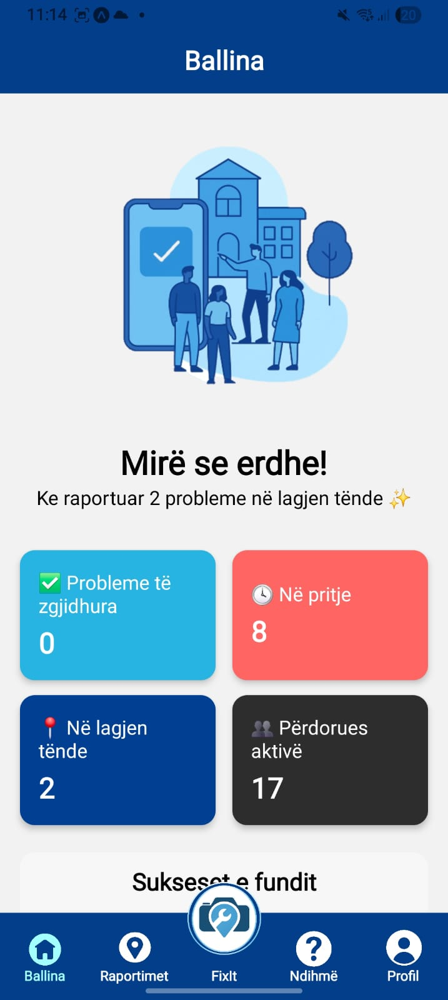
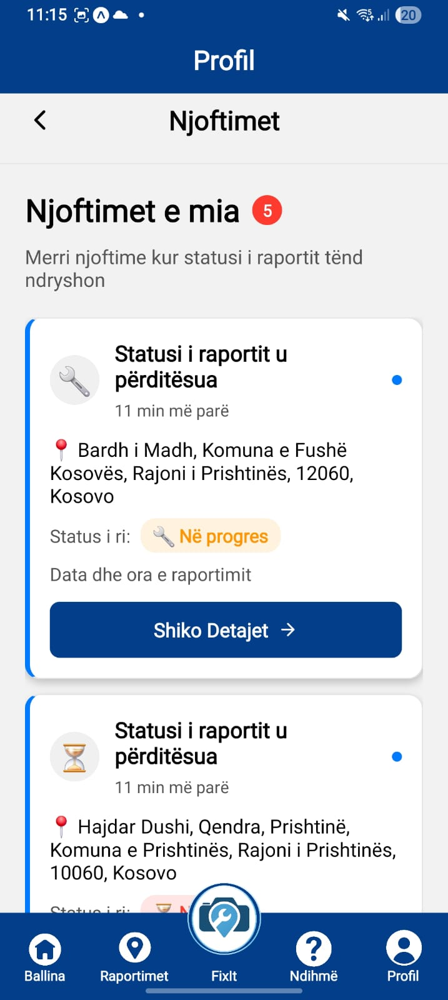
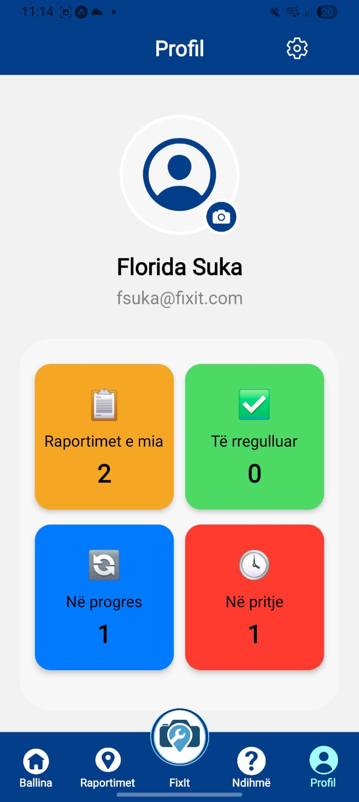
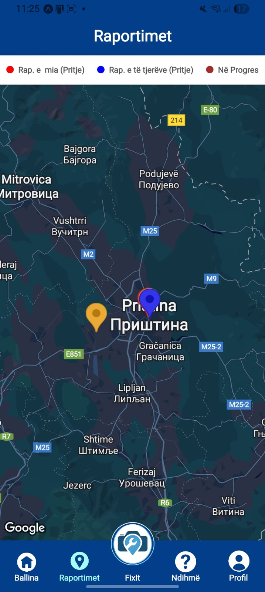
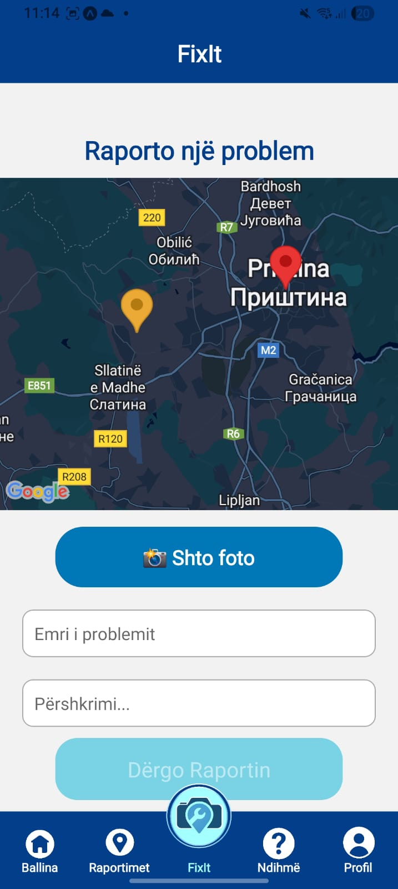

# **FixIt 🛠️  GRUPI 7**
### Pjesëtarët e Grupit

* __Albison Bekaj__
* __Ali Shoshi__
* __Leona Zullufi__
* __Floridë Suka__ 
---
### Përshkrimi i Projektit
**FixIt** është një aplikacion mobil i zhvilluar me React Native dhe Expo, që u jep qytetarëve mundësinë të raportojnë në mënyrë të shpejtë dhe të lehtë problemet në lagjen e tyre, si: 
* Dritat e rrugës që nuk funksionojnë
* Gropa në asfalt
* Ndotje
* Dëmtime të infrastrukturës publike
* Etj ...

***Qëllimi*** i aplikacionit është të përmirësojë komunikimin midis komunitetit dhe autoriteteve lokale, duke kontribuar në një lagje më të rregullët, sigurt dhe të pastër.

## __SHENIM__ 
### Aplikacioni nuk është funksional në WEB, përshkak të përdorimit të disa librarive
##  **Faza 1**
1. Ky projekt është ndërtuar me React Native dhe Expo, duke përdorur një strukturë të organizuar foldersh si /app, /components dhe /assets.  
2. Aplikacioni përfshin UI bazike me 5 ekrane funksionale me navigim të menaxhuar përmes Expo Router
    * __Home__ 'index'- Shfaq informacione bazike dhe lajmet e fundit rreth aplikacionit.
    * __Problems__ 'ProblemScreen' - Shfaq hartën gjeografike me probleme aktuale të raportuara.
    * __FixIt__ 'ReportScreen' - Mund të raportosh një problem të ri me foto, lokacion dhe përshkrimin përkatës.
    * __Help__ 'ContactsHelp' - Shfaq informacione rreth përdorimit të aplikacionit dhe ofron mundësinë për të kontaktuar ekipin përgjegjës
    * __Profile__  - Shfaq të dhënat e përdoruesit të regjistruar
3. Perdorimi i elementeve si :
    * __FlatList__ - Përdorur tek Settings.jsx
    * __TextInput__ - Plotësimi i formularit ne ekranin 'Help'
    * __TouchableOpacity__ - Përdorur përgjatë projektit
    * __StatusBar__ - Përdorur nga '_layout.jsx' për ngjyrën e status bar-it
    * __SafeAreaView__ - Përdorur në '_layout.jsx' ashtu që përmbajtja e aplikacionit të qëndrojë brenda zonave të sigurta të ekranit
    * __UseState__ - Është përdorur për të ruajtur dhe menaxhuar të dhënat lokale të një formulari kontakti në ekranin ContactScreen, apo aktivizimi i njoftimeve, zgjedhja e gjuhës në 'SettingsScreen'
    * __Shumë komponentë të tjerë ...__ - Si pjesë e funksionalitetit dhe ndërtimit të aplikacionit

##  **Faza 2**
1. Autentifikimi (Firebase Authentication)
    * Ofron mundësinë për regjistrim dhe hyrje me Email/Password ose me Google Sign-In.
    * Validimi i inputeve kryhet gjatë procesit të regjistrimit dhe hyrjes.
    * Pas hyrjes, përdoruesi ridrejtohet në faqen Ballina.
    * Për t’u bërë logout, shkoni te Profili → Ikona e ingranazhit → Dil.
2. CRUD me Firebase
    * __Create__: Përveç regjistrimit të përdoruesve të rinj, mundësohet edhe shtimi i raportimeve të reja përmes butonit FixIt apo dhe krijimi i një formulari të plotësuar nga përdoruesi
    * __Read__: Të dhënat lexohen nga databaza, si p.sh.:  
        * Raportimet në hartë te faqja Raportimet,
        * Informacionet e përdoruesit te Profili,
        * Statistikat në Ballina.
    * __Update__: Përdoruesi mund të modifikojë raportimet që ka krijuar, si dhe të dhënat personale në profil.
    * __Delete__: Mundësohet fshjirja e raportimeve
    * Është trajtuar logjika për loading, error, dhe success në disa faqe, përfshirë FixIt gjatë shtimit të raportimeve.
3.  Navigimi dhe UI
    Navigimi është plotësisht funksional nëpër të gjitha faqet kryesore.Gjithashtu Janë bërë përmirësime në UI për një përvojë më të mirë të përdoruesit.

##  **Faza 3**

1. Karakteristikat Teknikat
    * Aplikacioni integron module të avancuara të pajisjes për një eksperiencë interaktive:
        * **Camera / Image Picker:** Përdorimi i `expo-image-picker` për qasje në galeri dhe shkrepjen e fotove gjatë raportimit të një problemi në dritaren "ReportScreen"
        * **Local Notifications:** Menaxhimi i njoftimeve lokale përmes `expo-notifications`.
        * **GPS / Location:** Integrimi i `expo-location` për marrjen e koordinatave gjeografike në kohë reale për shfaqjen e problemeve ne hartë siq është dritarja "ReportScreen" dhe "ReportScreen"
2. UI / UX dhe Dizajni
    * Ndërfaqja është ndërtuar duke pasur parasysh pastërtinë dhe përdorshmërinë:
        * **Layout Profesional:** Konsistencë në paletën e ngjyrave, spacing (hapësirat) dhe padding.
        * **Keyboard Management:** Përdorimi i `KeyboardAwareScrollView` për të garantuar që inputet të mbeten të dukshme gjatë shkrimit.
        * **Animacionet:**
            * **Button Press:** Efekte `fade` të modalit tek dritarja "Raportimet" duke përdorur `TouchableOpacity`.
            * **Modals:** Janë përdorur për të shfaqur informacionet rreth raportimeve
            * **Task Feedback:** Animacione vizuale pas përfundimit të veprimeve (psh. dërgimi i një forme apo raportimi).
         * Screenshots

  
  
  

  
  

3. Optimizimi dhe Performanca
    * Për të siguruar që aplikacioni të jetë i shpejtë dhe efikas, janë përdorur teknikat e mëposhtme:
        1. Renderimi i Listave
            * Përdorimi i **FlatList** në vend të ScrollView tek dritarja "ReportScreen".
        2. React Memoization
            * **useCallback:** Përdoret për funksionet që u kalohen komponentëve fëmijë (child components) për të shmangur ri-renderimet e panevojshme.
            * **useMemo:** Ruajtja e vlerave të llogaritura që nuk ndryshojnë shpesh tek "ReportScreen" dhe "useProfilForm"
            * **React.memo:** Memoizimi i komponentëve statikë për të rritur shpejtësinë e UI.
        3. Assets
            * **Asset Optimization:** Kompresim i imazheve dhe teknika *lazy load* ku është e aplikueshme.

4. Testimi (Testing)
    * Projekti përfshin mbulimin me teste bazike duke përdorur Jest dhe React Native Testing Library:
        1.  **Snapshot Tests:** Verifikimi i strukturës së UI dhe ruajtja e snapshots për komponentët kryesorë.
        2.  **Interaction Tests:** * Testimi i shtypjes së butonave (Button press).
            * Validimi i inputeve të formave.
            * Kontrolli i dukshmërisë së modaleve.
        3.  **Mocking:** Përdorimi i funksioneve *mock* për të testuar logjikën pa pasur nevojë për qasje reale në API apo hardware.
